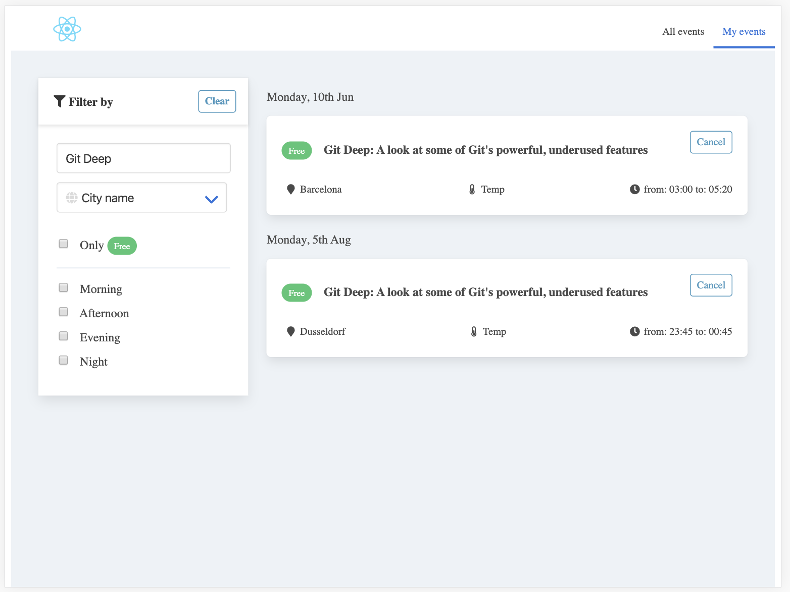

# tech-events-app

Basic UI developed using React, TypeScript, Redux, HTML, CSS that show lists of events and user can subscribe to them as part of list

## Desktop view

### Landing page

  
   

### My events page

  
   

## Mobile view

  
   

## iPad view

  
   

